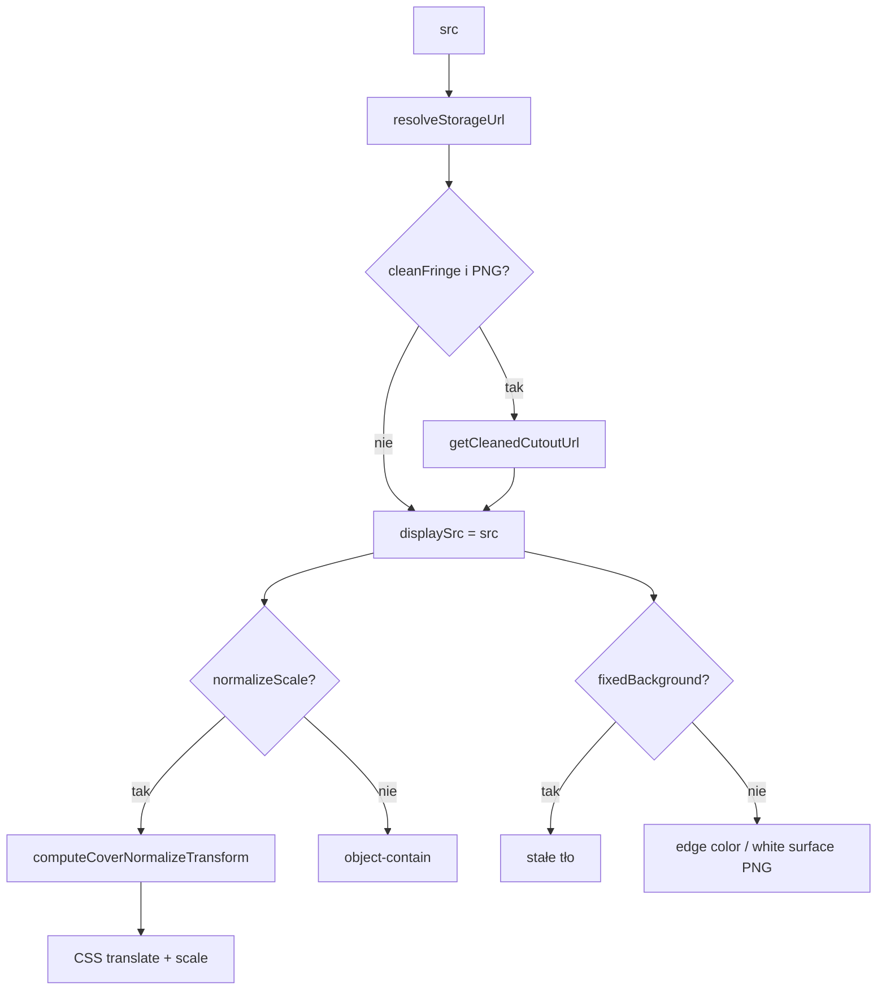

# ItemImage.vue

**Ścieżka:** `frontend/src/components/ItemImage.vue`

## Rola

Uniwersalna miniatura / cover itemu: tło, contain, opcjonalna **normalizacja skali/pozycji** i **czyszczenie fringe** cutoutów PNG.

## Props

| Prop | Domyślnie | Opis |
|---|---|---|
| `src` | null | URL obrazu |
| `containerClass` / `imgClass` | | Layout Tailwind |
| `normalizeScale` | false | CSS transform dopasowujący obiekt w kwadracie |
| `normalizeFill` | 0.66 | Docelowy udział obiektu w kadrze |
| `normalizeAlign` | `bottom` | `bottom` (baseline) lub `center` |
| `fixedBackground` | null | Stały kolor tła (pomija edge-detect) |
| `cleanFringe` | false | Canvas cleanup white spill / szarego ducha |
| `checkerboard` | false | Tryb podglądu alphę |
| `fallbackBg` | | Gdy brak edge color |

## Pipeline wyświetlania

## Normalizacja (`imageCoverNormalize.js`)

- Analiza foreground (alpha albo flood-fill tła).
- Skalowanie do `fill`; kotwica dołu (baseline) lub środka.
- Wysokie obiekty (sukienki, `boxH > 0.82`) wymuszają center i mniejszy padding.

## Fringe (`imageCutoutFringe.js`)

- `removeDetachedGrayMatte` — na ciemnych produktach usuwa izolowany szary „duch”.
- `decontaminateFringeColors` — podmienia jasny spill na kolor sąsiedniego opaque.

Używane w siatce (`ProductList`) z `clean-fringe` + szarym tłem.

## Powiązania

- `ProductList`, `Product`, flat-lay / outfit pickery
- Utils: `imageCoverNormalize.js`, `imageCutoutFringe.js`, `imageEdgeColor.js`
