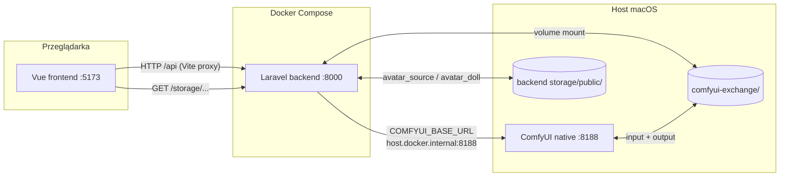
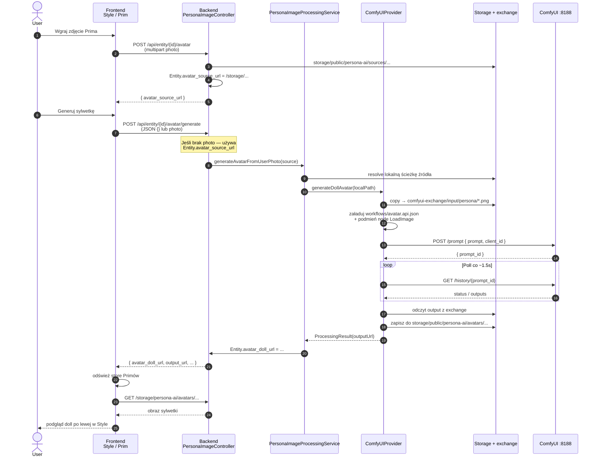
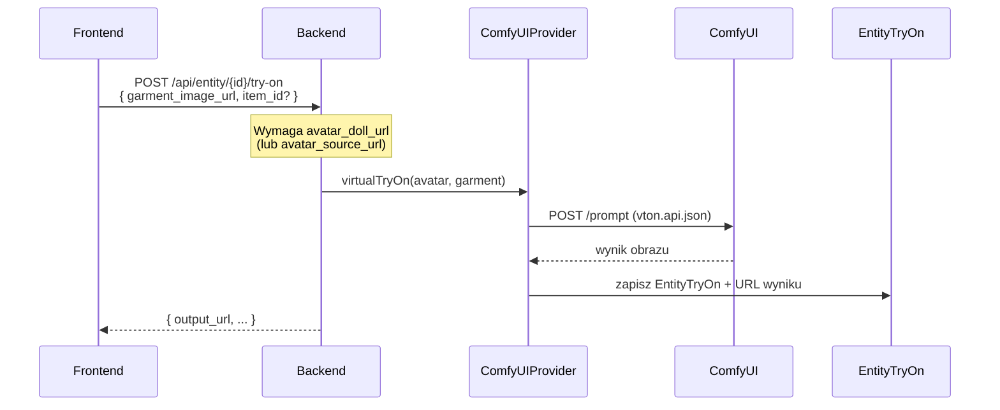
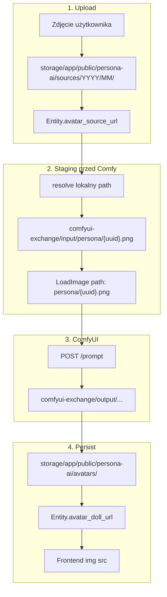

# Persona Vision — przepływ Frontend → Backend → ComfyUI

Dokument opisuje, jak zdjęcie Prima przechodzi przez stack nohooks: od UI (Style / Prim overview), przez Laravel API, kolejkę ComfyUI, z powrotem do frontendu jako sylwetka (`avatar_doll_url`).

## Architektura (Mac, zalecane)



**Kluczowa zasada:** przeglądarka **nie** gada z ComfyUI. Tylko backend woła API Comfy; frontend dostaje gotowe URL-e z Laravel storage.

| Warstwa | Adres | Rola |
|---|---|---|
| Frontend | `http://localhost:5173` | Upload, przycisk „Generuj sylwetkę”, podgląd doll |
| Backend | `http://localhost:8000` | Auth, zapis Entity, staging plików, polling Comfy |
| ComfyUI | `http://127.0.0.1:8188` (z hosta) / `http://host.docker.internal:8188` (z kontenera backendu) | Uruchomienie workflow `avatar.api.json` / `vton.api.json` |
| Exchange | `./comfyui-exchange` | Wspólny katalog input/output między backendem a Comfy |

Konfiguracja: `COMFYUI_BASE_URL` w root `.env` + `backend/.env` (domyślnie `http://host.docker.internal:8188`).

---

## Sekwencja: generowanie sylwetki (avatar doll)



---

## Sekwencja: virtual try-on (ubiór na doll)



---

## Endpointy HTTP (backend)

Wszystkie pod `auth:sanctum`.

| Metoda | Ścieżka | Opis |
|---|---|---|
| `GET` | `/api/persona-vision/status` | `{ provider, configured, comfyui_url }` — health Comfy |
| `POST` | `/api/entity/{entity}/avatar` | Upload zdjęcia źródłowego (bez AI) |
| `DELETE` | `/api/entity/{entity}/avatar` | Czyści source + doll |
| `POST` | `/api/entity/{entity}/avatar/generate` | Generuje doll (Comfy workflow `avatar`) |
| `POST` | `/api/entity/{entity}/try-on` | Virtual try-on (workflow `vton`) |
| `GET` | `/api/entity/{entity}/try-ons` | Historia przymiarek |

Frontend client: [`frontend/src/services/personaImageProcessing.js`](frontend/src/services/personaImageProcessing.js)  
UI Style: [`frontend/src/views/Style.vue`](frontend/src/views/Style.vue) (lewa kolumna = sylwetka).

---

## Co dzieje się z plikami



Volume w `docker-compose.yml`:

- `./comfyui-exchange` → backend: `storage/app/comfyui-exchange`
- ten sam katalog = Comfy `--input-directory` / `--output-directory` (skrypt native)

Dzięki temu **obrazy nie wychodzą na zewnętrzne API** — tylko lokalny stack.

---

## Warstwa kodu (backend)

```text
PersonaImageController          HTTP, walidacja, JSON response
        │
        ▼
PersonaImageProcessingService   wybór providera, persist Entity
        │
        ▼
ComfyUIProvider                 stage plików, /prompt, poll /history
        │
        ▼
ComfyUIWorkflowBuilder          ładuje *.api.json + inject node inputs
```

Workflowy: [`comfyui/workflows/avatar.api.json`](comfyui/workflows/avatar.api.json), [`comfyui/workflows/vton.api.json`](comfyui/workflows/vton.api.json)  
Mapowanie ID węzłów: `config/persona_ai.php` → `comfyui.node_map`.

---

## Uruchomienie (Mac)

1. Stack aplikacji: `docker compose up -d`
2. ComfyUI na hoście (MPS): `./scripts/start-comfyui-native.sh`
3. Sprawdź: `GET /api/persona-vision/status` → `configured: true`, `comfyui_url: http://host.docker.internal:8188`
4. UI Comfy: http://127.0.0.1:8188

**Uwaga:** obecny `avatar.api.json` to szablon (LoadImage → SaveImage). Żeby dostać prawdziwą „lalkę”, trzeba podmienić graf w ComfyUI (np. SD + OpenPose/ControlNet), wyeksportować **Save (API Format)** i zaktualizować `node_map` w configu.

---

## Typowe błędy

| Objaw | Znaczenie |
|---|---|
| `Brak połączenia z ComfyUI (http://comfyui:8188)` | Zły `COMFYUI_BASE_URL` albo stary proces backendu — ma być `host.docker.internal:8188` + recreate backend |
| `Brak połączenia z ComfyUI (http://host.docker.internal:8188)` | Comfy nie działa — odpal `./scripts/start-comfyui-native.sh` |
| `Prompt outputs failed validation` | Workflow API nie pasuje do grafu / placeholder — popraw `avatar.api.json` |
| `configured: false` przy status | Backend nie dosięga Comfy (sieć lub proces) |
