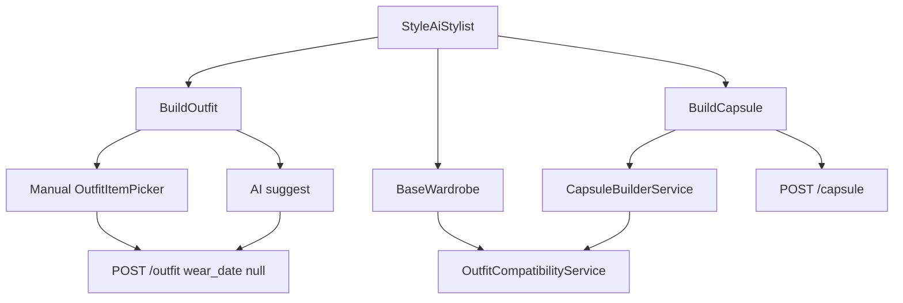

# Stylist — outfity, baza szafy, kapsuły

Dokument opisuje, jak działa przebudowany Stylist: budowanie looków z posiadanej szafy, analiza potencjału outfitów oraz kapsuły (w tym stan „Almost there” z brakującymi rolami).

## Cel produktu

Stylist **nie** jest dashboardem analitycznym ani sklepem.

Kolejność logiki:

1. Posiadana szafa (owned items)
2. Składanie outfitów / looków
3. Budowa kapsuły
4. Wykrycie brakujących **ról** szafy (typ/rola, nie konkretny produkt)
5. Szacunek dodatkowych outfitów po uzupełnieniu roli

Zakupy pojawiają się dopiero wtórnie (osobny flow `wardrobe_needs` / marki w ustawieniach konta) — nie jako punkt startowy Stylisty.

## Trzy tryby UI

Trasa: `/style/ai-stylist` · komponent: [`frontend/src/views/StyleAiStylist.vue`](../frontend/src/views/StyleAiStylist.vue)

| Tryb | Co robi użytkownik | Silnik |
|---|---|---|
| **Build an outfit** | Manual picker albo AI | FE picker / `POST /fashion-stylist/suggest` |
| **Base wardrobe** | Liczy kompletne outfity z szafy | `POST /fashion-stylist/base-wardrobe` (deterministyczny) |
| **Build a capsule** | Preset lub custom → analiza → zapis | `POST /capsule/analyze` + CRUD `/capsule` |



---

## Look vs outfit kalendarzowy

Tabela `outfits` obsługuje dwa przypadki przez **nullable `wear_date`**:

| | Look (Stylist) | Kalendarz (Style / edytor) |
|---|---|---|
| `wear_date` | `null` | data dnia |
| Unikalność | wiele looków na Prima | max 1 outfit na Prim+dzień (partial unique index) |
| Zapis | zawsze insert | upsert po `entity_id` + `wear_date` |
| Filtr API | `?looks_only=1` | `?calendar_only=1` / `from`+`to` |

Migracja: `2026_09_20_200000_make_outfit_wear_date_nullable_for_looks.php`.

Frontend: Stylist woła `outfitsStore.createOutfit({ …, wear_date: null, source: 'manual'|'llm' })`.  
Strona Style / `StyleOutfitEditor` nadal wysyła `wear_date`.

---

## 1. Build an outfit

### Manual

1. Wybór Prima + opcjonalnie nazwa / okazja.
2. [`OutfitItemPicker`](../frontend/src/components/outfit/OutfitItemPicker.vue) — itemy fashion + `itemFitsPersona`, filtry grup kolekcji, cutouty jak w edytorze.
3. Badge kompletności po stronie FE (heurystyka slotów: dress+buty albo top+bottom+buty).
4. **Save look** → `POST /api/outfit` bez daty.

### AI Stylist

1. Okazja, preferencje (`notes`), opcjonalny **anchor item** (single-select w pickerze).
2. `POST /api/fashion-stylist/suggest` z `entity_id`, `occasion`, `notes`, `anchor_item_id`.
3. Backend dokleja anchor do promptu; LLM zwraca tylko ID **posiadanych** itemów (`FashionStylistService` + repair przez `GarmentAttributes::isCompleteOutfit`).
4. Wynik: karty + `OutfitFlatLay`; akcje: Save look, Regenerate, Edit manually (prefills picker).

Jeśli OpenAI nie jest skonfigurowane: tryb AI pokazuje banner; Manual / Base / Capsule działają bez LLM.

---

## 2. Base wardrobe

Endpoint: `POST /api/fashion-stylist/base-wardrobe`

Serwis: [`OutfitCompatibilityService`](../backend/app/Services/Wardrobe/OutfitCompatibilityService.php)

```json
{
  "item_count": 43,
  "outfit_count": 24,
  "truncated": true,
  "outfits": [{ "item_ids": [1, 2, 3], "score": 1.0, "occasion": ["work"] }],
  "by_occasion": { "casual": 24 }
}
```

**Jak liczy (v1):**

- Slotowanie itemów: `GarmentAttributes::outfitSlot` (`one_piece` | `top` | `bottom` | `footwear` | `outerwear` | `other`).
- Komplet = `one_piece`+`footwear` **albo** `top`+`bottom`+`footwear` (opcjonalnie + outerwear).
- Enumeracja po slotach, **limit** (domyślnie 80) — `truncated: true` gdy osiągnięty limit.
- **Nie** używa naiwnego `tops × bottoms × shoes` bez limitu i **nie** wymyśla itemów.
- Kolor / formalność / styl: haki pod soft filtry + TODO (brak `formality` na itemach).

UI pokazuje liczbę itemów, liczbę kompletnych outfitów, karty kombinacji; „Edit manually” przełącza do Build outfit z wybranymi ID.

---

## 3. Build a capsule

### Dane

| Tabela | Rola |
|---|---|
| `capsules` | `user_id`, `entity_id`, `name`, `preset`, `occasion`, `season`, `style`, `target_outfit_count`, `item_limit` |
| `capsule_item` | posiadane itemy w kapsule (`sort_order`) |

Presety: `work` | `travel` | `summer` | `winter` | `smart_casual` | `evening` | `custom`.

### Analiza (bez zapisu)

`POST /api/capsule/analyze` → [`CapsuleBuilderService`](../backend/app/Services/Wardrobe/CapsuleBuilderService.php)

1. Filtr szafy: fashion-ish + `fitsPersona(entity_id)` + opcjonalnie sezon.
2. Role wymagane per preset (np. work: 2 tops, 1 bottom, 1 outerwear/blazer, 1 footwear).
3. Dobór subsetu itemów (limit sztuk).
4. `OutfitCompatibilityService` liczy potencjał outfitów z subsetu.
5. Jeśli role niepokryte lub potencjał za niski → `status: "incomplete"` + `missing_roles[]`:

```json
{
  "role": "outerwear",
  "label": "Neutral blazer",
  "reason": "Needed as a … to complete more outfits using clothes you already own.",
  "unlocks_outfits_estimate": 5,
  "estimate": true
}
```

Unlock: porównanie liczby outfitów przed/po **hipotetycznym** fillerze slotu (estimate, nie produkt ze sklepu).

### Zapis

`POST /api/capsule` z `item_ids` z analizy (lub auto-analiza przy pustym `item_ids`).  
CRUD: `GET/PUT/DELETE /api/capsule/{id}`, ponowna analiza: `POST /api/capsule/{id}/analyze`.

UI: Complete vs Almost there, pokrycie ról `covered/required`, lista braków z `+N outfits`, przykładowe flat-laye, **Save capsule**.

---

## API (auth:sanctum)

| Method | Path | Opis |
|---|---|---|
| GET | `/api/fashion-stylist/status` | Czy LLM skonfigurowany |
| POST | `/api/fashion-stylist/suggest` | AI outfit (opcjonalnie `anchor_item_id`) |
| POST | `/api/fashion-stylist/base-wardrobe` | Deterministyczna analiza |
| GET/POST | `/api/outfit` | Looki i kalendarz; filtry `looks_only`, `calendar_only` |
| GET/POST | `/api/capsule` | Lista / tworzenie |
| POST | `/api/capsule/analyze` | Analiza bez zapisu |
| POST | `/api/capsule/{id}/analyze` | Re-analiza zapisanej |

Store FE: `fashionStylist.js`, `capsules.js`, `outfits.js` (getter `looks`).

---

## Pliki kluczowe

| Warstwa | Plik |
|---|---|
| UI | `frontend/src/views/StyleAiStylist.vue` |
| Picker | `frontend/src/components/outfit/OutfitItemPicker.vue` |
| Flat lay | `frontend/src/components/outfit/OutfitFlatLay.vue` |
| Compat | `backend/app/Services/Wardrobe/OutfitCompatibilityService.php` |
| Capsule | `backend/app/Services/Wardrobe/CapsuleBuilderService.php` |
| Controllers | `FashionStylistController`, `CapsuleController`, `OutfitController` |
| Sloty | `backend/app/Support/GarmentAttributes.php` |
| LLM suggest | `backend/app/Services/FashionAi/FashionStylistService.php` |

---

## Co świadomie nie jest w v1

- Pełny silnik kompatybilności kolor/styl/formalność (tylko sloty + soft season).
- Persystencja snapshotu `missing_roles` w DB (liczone przy analyze).
- Primary CTA „kup produkt” w kapsule incomplete.
- Osobna biblioteka looków poza `outfits` z `wear_date = null`.
