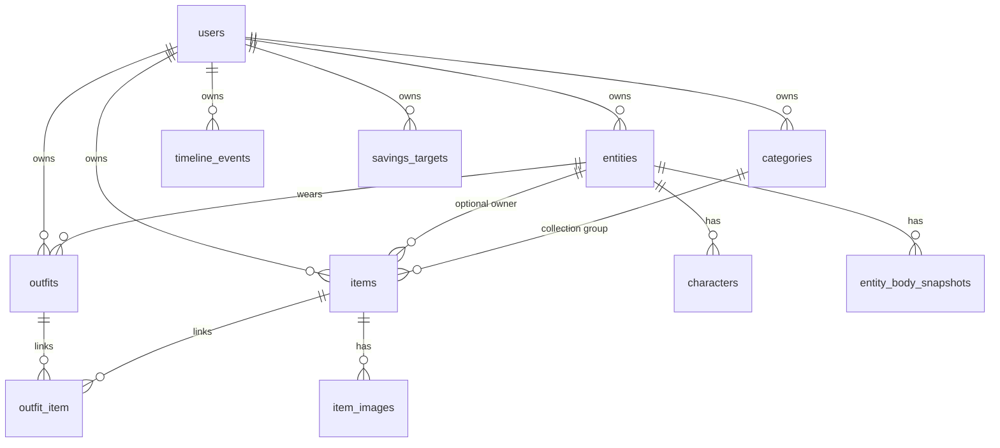

---
tags:
  - database
  - schema
---

# Struktura danych w bazie

Aplikacja używa **PostgreSQL** (Docker: `nohooks-db`) i Eloquent. Większość domenowych tabel jest **multi-tenant** przez `user_id` (`BelongsToUser`).

## Diagram relacji (domena główna)

---

## `users`

Konto logowania (Sanctum).

| Kolumna | Typ | Opis |
|---|---|---|
| `id` | PK | |
| `name`, `username`, `email`, `password` | | Auth + profil |
| `avatar`, `bio` | nullable | Profil |
| `net_salary_pln` | float nullable | Pensja netto (finanse) |
| `fashion_stores` | JSON array | Preferowane sklepy Fashion AI |
| `email_verified_at`, `remember_token` | | Standard Laravel |

---

## `entities` (persony / Primy)

| Kolumna | Typ | Opis |
|---|---|---|
| `id` | PK | |
| `user_id` | FK → users | Właściciel |
| `name`, `description` | | |
| `type` | string | np. persona / animal |
| `gender` | nullable | |
| `species`, `sex`, `birth_date` | nullable | Zwierzęta / meta |
| `avatar_source_url` | nullable | Oryginalne zdjęcie |
| `avatar_doll_url` | nullable | Wygenerowana sylwetka (ComfyUI) |
| `avatar_generated_at` | datetime nullable | |

Relacje: `characters`, `bodySnapshots`, `outfits`, `items`, `tryOns`.

---

## `characters`

Szczegóły wyglądu powiązane z entity (opcjonalne).

| Kolumna | Typ | Opis |
|---|---|---|
| `entity_id` | FK → entities | |
| `fname`, `lname`, `nickname` | | |
| `description` | | |
| `birth_gender`, `height`, `weight` | | |
| `hair_*`, `eye_color`, `skin_color`, `blood_type` | | Wygląd |

---

## `entity_body_snapshots`

Pomiary ciała w czasie.

| Kolumna | Typ | Opis |
|---|---|---|
| `entity_id` | FK | |
| `recorded_at` | date | |
| `height_cm`, `weight_kg`, … | float nullable | Standardowe wymiary |
| `custom_measurements` | JSON | Extra |
| `notes` | text | |

---

## `categories` (kolekcje)

Grupa itemów w UI „Collection” (np. clothes, shoes). **Nie mylić** z polem `items.category` (podkategoria / typ ubrania).

| Kolumna | Typ | Opis |
|---|---|---|
| `id` | PK | W API często jako `groupId` |
| `user_id` | FK | |
| `name` | string | Nazwa kolekcji |

---

## `items`

Główny rekord produktu / ubrania / przedmiotu w szafie.

| Kolumna | Typ | Opis |
|---|---|---|
| `id` | PK | |
| `user_id` | FK | Multi-tenant |
| `entity_id` | FK nullable | Historyczne / opcjonalne powiązanie |
| `character_id` | FK nullable | |
| `category_id` | FK → categories | **Kolekcja** (grupa) |
| `name` | string | |
| `category` | string nullable | Typ w kolekcji (np. dress, sneakers) |
| `brand` | string nullable | Znormalizowany slug/wartość |
| `description`, `notes` | text | |
| `color` | string(64) nullable | **Kolor główny** (pierwszy z `colors`) |
| `colors` | JSON array nullable | **Wszystkie warianty kolorystyczne** jednego itemu |
| `season` | string(32) | |
| `size`, `size_system` | | `eu` / `us` dla butów |
| `body_zone` | enum-ish | `head`, `torso`, `legs`, `feet`, `full` |
| `wear_layer` | enum-ish | `outer`, `mid`, `base`, `accent` |
| `garment_attributes` | JSON | Atrybuty typowane (np. hosiery: denier) |
| `rarity` | string | `common`…`legendary` |
| `like_rating` | int 1–5 | |
| `fits_all_personas` | bool | |
| `fits_persona_ids` | JSON array | Gdy nie pasuje do wszystkich |
| `default_persona_id` | FK → entities | |
| `gift` | bool | Brak ceny zakupu |
| `purchase_price`, `purchase_currency`, `purchase_price_pln` | | Zakup |
| `current_value` | decimal | |
| `purchase_date` | date | |
| `status` | string | np. `owned` |
| `source_url` | url | Strona produktu |

### Kolory (`color` vs `colors`)

- `colors` — lista slugów (`czarny`, `bialy`, …); jeden item, wiele wariantów (bez duplikowania rekordu).
- `color` — synchronizowany z `colors[0]` przy zapisie API.
- Stare rekordy bez `colors` są backfillowane migracją; frontend używa `itemColorsList()` z fallbackiem do `color`.

Appendowane w API: `image_url`, `cutout_image_url` (z pierwszej `item_images`).

---

## `item_images`

| Kolumna | Typ | Opis |
|---|---|---|
| `item_id` | FK | |
| `image_path` | storage path nullable | Lokalny plik |
| `external_url` | nullable | Zewnętrzny URL |
| `cutout_path` | nullable | PNG z alphą (flat-lay / stylist) |
| `sort_order` | int | 0 = cover |

Appendowane: `url`, `cutout_url` → `/storage/...`.

---

## `outfits` + `outfit_item`

| `outfits` | | |
|---|---|---|
| `user_id`, `entity_id` | FK | Persona + właściciel |
| `wear_date` | date | Unique per (user, entity, date) |
| `label`, `notes` | | |
| `occasion` | string | `school`, `work`, `home`, … |
| `source` | `manual` \| `llm` | |

| `outfit_item` | | |
|---|---|---|
| `outfit_id`, `item_id` | FK | Unique para |
| `sort_order` | int | Kolejność warstw |

---

## `timeline_events`

Kalendarz, urodziny, planned expenses, growth goals (część pól).

| Kolumna | Typ | Opis |
|---|---|---|
| `user_id` | FK | |
| `event_date`, `start_time`, `end_time`, `all_day` | | Czas |
| `label`, `location`, `description`, `notes`, `link` | | Treść |
| `type` | string | np. `birthday`, `planned_expense`, growth |
| `color` | `#RRGGBB` nullable | |
| `recurrence` | nullable | `monthly`, `quarterly`, `half_yearly`, `yearly` |
| `planned_amount`, `currency` | | Wydatki planowane |
| `expense_category` | string | Slug kategorii |
| `is_active`, `usage_*` | | |
| `growth_goal_id`, `work_minutes` | | Growth |

---

## `expense_categories`

| Kolumna | Typ | Opis |
|---|---|---|
| `user_id` | nullable | `null` dla builtin |
| `slug`, `name` | | |
| `is_builtin` | bool | Widoczne wszystkim |

Scope: builtin **lub** należące do zalogowanego usera.

---

## `savings_targets`

| Kolumna | Typ | Opis |
|---|---|---|
| `pk` | PK autoincrement | Surrogate |
| `id` | string | Logiczny id (route key) |
| `user_id` | FK | |
| `name`, `type`, `amount`, `color` | | |
| `is_primary` | bool | |
| `included_asset_ids` | JSON | Portfel |
| `progress_snapshots` | JSON | Historia postępu |
| `sort_order` | int | |

---

## `user_workspace_documents`

Elastyczny JSON per user (np. backup UI / workspace).

| Kolumna | Typ | Opis |
|---|---|---|
| `user_id` | FK | |
| `document_key` | string | Klucz dokumentu |
| `payload` | JSON | Treść |

---

## `app_settings`

Globalne ustawienia klucz–wartość (`key`, `value`) — nie per-user.

---

## Inne / pomocnicze

| Tabela | Rola |
|---|---|
| `personal_access_tokens` | Sanctum |
| `cache`, `jobs`, `failed_jobs` | Laravel |
| `inventories` | Legacy / rzadko używane |
| `entity_try_ons` | VTON / try-on historia |

---

## Konwencje API ↔ frontend

- Kolekcja w UI = `categories` (`groupId` = `category_id` itemu).
- Lista kolorów w UI = `colors[]`; filtry matchują **dowolny** kolor z listy.
- Obrazy: preferuj lokalne `/storage/...` przez proxy Vite; cutout osobno w `cutout_path`.
- FormData: tablice/JSON (`colors`, `garment_attributes`) często wysyłane jako string JSON i dekodowane w `ItemController`.

---

## Vault

- [[Home]] · [[MOC Database]]
- Komponenty: [[ItemForm]] · [[ProductList]] · [[ItemImage]]
