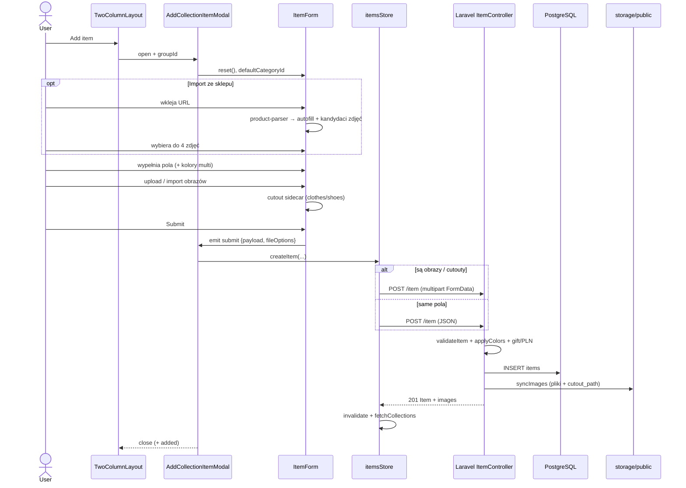

---
tags:
  - flow
  - item
  - collection
aliases:
  - Dodawanie itemu
  - Add item flow
---

# Flow: dodawanie itemu

Opis end-to-end: od przycisku w UI kolekcji do rekordu w bazie i plików w storage.

## Wejścia (gdzie user klika)

| Wejście | Kontekst |
|---|---|
| Przycisk **Add item** w layoutcie kolekcji | `TwoColumnLayout` → `showAddItemModal` → [[AddCollectionItemModal]] |
| Widok `Items.vue` (lista admin/legacy) | Ten sam [[ItemForm]], bez modalu kolekcji |

Najczęstsza ścieżka: **Collection → Add item**.

---

## Diagram (happy path)



---

## Krok po kroku

### 1. Otwarcie modalu

1. User jest w kolekcji (`groupId` = `categories.id`).
2. `TwoColumnLayout` ustawia `showAddItemModal = true`.
3. [[AddCollectionItemModal]] dostaje `groupId` + `collectionName`.
4. Przy `open`:
   - `collectionStore.fetchCollections()`
   - `ItemForm.reset()` — puste pola, `category_id` = domyślna kolekcja

### 2. Wypełnianie formularza ([[ItemForm]])

**Opcja A — ręcznie**

- Nazwa, rarity, like, brand, sezon, rozmiar, opis, notatki, cena / gift, persona fit.
- **Kolory:** multi-select kółkami → `form.colors[]` (nie osobne itemy na kolor).
- Typ ubrania (`category`) + `body_zone` / `wear_layer` / hosiery attrs gdy clothing.

**Opcja B — import ze sklepu**

1. User wkleja `source_url`.
2. Frontend woła product-parser (przez API).
3. Autofill: name, brand, color(s), size, description, cena…
4. Lista kandydatów zdjęć (CDN) — user zaznacza max **4**.
5. Wybrane trafiają do `imageEntries` (kolejność zaznaczenia = kolejność galerii; pierwsze = cover).
6. Opcjonalnie `trace_id` Langfuse do śledzenia importu.

### 3. Obrazy i cutout (przed zapisem)

Dla kolekcji **clothes / shoes** formularz generuje **sidecar cutout** (PNG z alphą) po stronie przeglądarki:

1. Upload lokalny albo URL z importu.
2. `ensureEntryOutfitCutout` → `preparePersistedOutfitCutout` (z `colorHint` = pierwszy kolor).
3. Cutout trzymany w pamięci jako `cutoutFile` (blob), osobno od oryginału galerii.
4. Submit blokowany, dopóki trwają pobieranie / wycinka (`hasPendingImageEntries`).

Buty mogą dodatkowo przejść orientację (`prepareShoeCoverImage`).

### 4. Submit → payload

`ItemForm.handleSubmit()`:

1. Czeka na gotowe obrazki + `ensureAllOutfitCutouts()`.
2. `buildPayload()` — m.in.:
   - `category_id` (kolekcja)
   - `colors: JSON.stringify([...])`, `color: colors[0]`
   - `garment_attributes: JSON.stringify(...)`
   - ceny / gift / persona fit
3. `buildImageFileOptions()` → `newImages`, `newImageUrls`, `newCutoutImages`, `newUrlCutoutImages`, `image_order_slots`, `traceId`.
4. `emit('submit', { payload, fileOptions })`.

### 5. Store → API

[[AddCollectionItemModal]] → `itemsStore.createItem(payload, fileOptions)`:

| Warunek | Transport |
|---|---|
| Są nowe obrazki / cutouty / URL-e | `POST /item` jako **multipart FormData** |
| Tylko pola tekstowe | `POST /item` jako **JSON** |

Po sukcesie store:

- dokłada item do lokalnej listy,
- `invalidateAllItemsList()`,
- `fetchCollections()` — siatka [[ProductList]] dostaje świeże dane.

Modal zamyka się (`@close`); opcjonalnie `@added`.

### 6. Backend (`ItemController::store`)

1. `validateItem(creating: true)` — reguły pól + uploadów.
2. `prepareColorsInput` — dekoduje JSON/`colors[]`.
3. `applyColors` — normalizacja listy; `color = colors[0]`.
4. `applyGiftRules` / `applyPurchasePln` — waluta → PLN.
5. `Item::create($data)` → wiersz w `items`.
6. `syncImages`:
   - zapis `new_images` → `item_images.image_path`,
   - albo `new_image_urls` → `external_url`,
   - cutouty → `cutout_path`,
   - `image_order_slots` ustala `sort_order` (0 = cover),
   - opcjonalna orientacja butów po stronie serwera.
7. Odpowiedź **201** z itemem + relacjami (`images`, `collectionGroup`, …).
8. Opcjonalnie Langfuse span `item.create` / `item.create.images`.

### 7. Co widać potem w UI

- Kafelek w [[ProductList]]: cover (pierwszy obraz), swatche z `colors[]`, szare tło + `cleanFringe` na PNG.
- Szczegóły [[Product]]: galeria, wszystkie kolory, meta.
- Flat-lay / stylista: preferują `cutout_url` z `item_images`.

---

## Ścieżki danych (skrót)

```
UI form.colors[]  ──JSON──►  API colors[]  ──►  items.colors + items.color
UI imageEntries   ──files──►  item_images.image_path | external_url
UI cutoutFile     ──files──►  item_images.cutout_path
UI category_id    ─────────►  items.category_id  (= kolekcja)
UI category       ─────────►  items.category     (= typ: dress, …)
```

---

## Błędy i blokady

| Sytuacja | Zachowanie |
|---|---|
| Brak `groupId` w modalu | Submit nic nie robi |
| Obrazy jeszcze się ładują / tną | Submit anulowany + komunikat |
| Walidacja API (np. za duży plik) | Modal pokazuje `error.message` |
| Cutout się nie udał | Item i tak może się zapisać bez `cutout_path` (ostrzeżenie w konsoli) |
| > 4 zdjęcia | Limit `MAX_IMAGES` w formularzu i API |

---

## Powiązane noty

- [[AddCollectionItemModal]] — shell modalu
- [[ItemForm]] — pola, import, cutout
- [[ItemImage]] / [[ProductList]] — jak item wygląda po dodaniu
- [[Database schema]] — tabele `items`, `item_images`, `categories`
- [[EditItemModal]] — ten sam form, ścieżka `PUT /item/{id}`

---

## Vault

- [[Home]] · [[MOC Flows]] · [[MOC Components]]
- [[AddCollectionItemModal]] · [[ItemForm]] · [[Database schema]]
